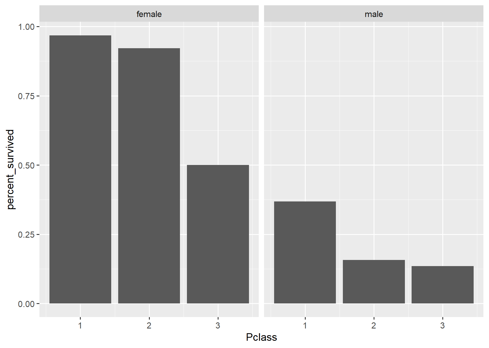
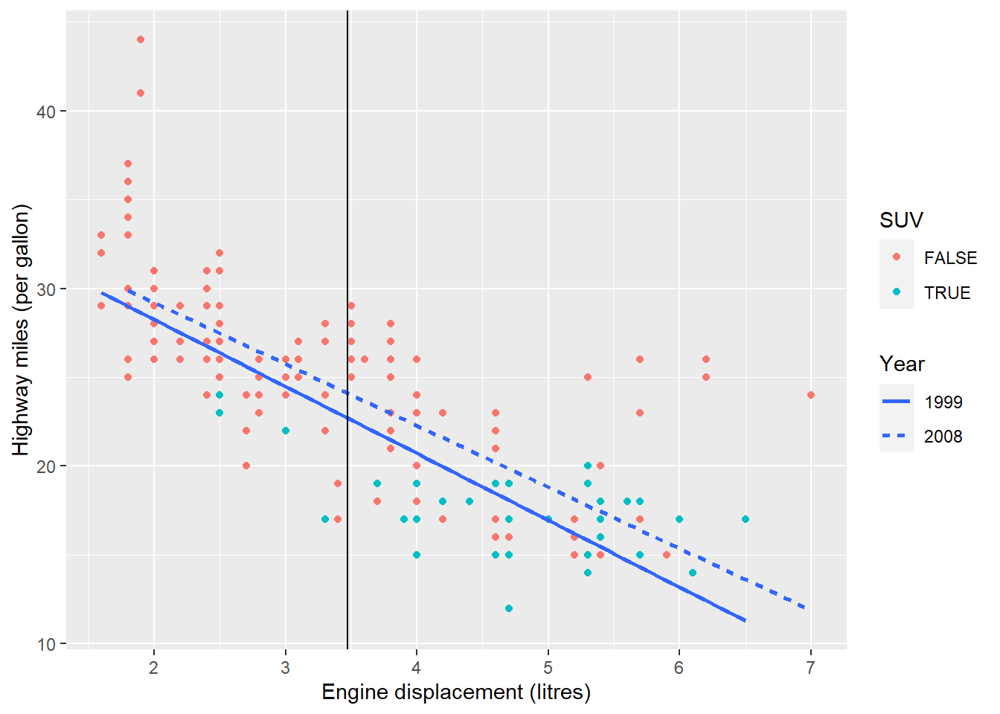

```{r setup, include=FALSE}
knitr::opts_chunk$set(echo = TRUE,comment = '#>',error=TRUE, results = 'hold', out.width='70%', fig.align = 'center')
```

基本題 (共 100 分)
=====================

視覺化死亡率 (共 40 分)
------------------------

```{r message=FALSE}
# 請勿更動此 code chunk 程式碼
library(dplyr)
library(ggplot2)

# 上週作業使用到的 titanic data
titanic <- readr::read_delim("titanic.csv", 
                             delim = ";", 
                             escape_double = FALSE, 
                             trim_ws = TRUE)
# 上週作業 `分組摘要` 的結果
died_summary <- titanic %>% 
  group_by(Sex, Pclass) %>%
  summarise(percent_survived = mean(Survived == "Yes")) %>%
  ungroup()
died_summary 
```

此題延續上週作業關於鐵達尼號乘客死亡率的[分組摘要](https://rlads2021.github.io/hw5/index.html#分組摘要-30-分)。上方的程式碼即是上週分組摘要的答案，儲存於 `died_summary`。你的任務是使用 `ggplot2` 將 `died_summary` 繪製成[此長條圖](#bar-chart):

```{r}
# Write your code here
ggplot(died_summary) +
  geom_bar(aes(Pclass, percent_survived),
           stat = "identity") +
  facet_wrap(vars(Sex))
```

<div class="alert alert-success hint">
1. 如果不知道如何下手，請先閱讀 [R for Data Science 第三章](https://r4ds.had.co.nz/data-visualisation.html)
1. 你應該會使用到 `geom_bar()` 或是 `geom_col()`
1. 你應該會使用到 `facet_wrap()`
1. 輸出結果應與下圖相同：

{#bar-chart .half}
</div>


自己的資料自己畫 (共 50 分)
-----------------------------

請自行尋找一份資料 (不得使用 `titanic.csv` 或內建資料)，將其放在此次作業的 repo 並命名為 `mydata.csv` (副檔名請根據自己的資料而定, e.g., 若為 tab 分隔檔，請命名為 `mydata.tsv`)。你的任務是將這份資料讀入並使用 ggplot2 視覺化這份資料。

1. (10 分) **資料讀取與清理**  
將 `mydata.csv` 讀入並進行資料清理 (如果需要的話)，以利接下來的資料視覺化

2. (30 分) **資料視覺化**  
請依這份資料的特性以及你想觀察的現象，對這份資料進行視覺化。依據你的喜好，你可以畫任意多張圖，但**其中一張圖裡「必須」使用到 2 種或 2 種以上的 `geom_*()` 函數** (助教也只會依據這張圖評分)。這些 `geom_*()` 的使用需合理。例如，下方的例子雖然仍畫得出圖，但顯然是不合理的，這種情況將不予給分：
    ```{r}
    ggplot(iris) +
      geom_bar(aes(x = Species)) +
      geom_point(aes(Sepal.Length, Petal.Width))
    ```

3. (10 分) **Tweak the plot**  
請依據你的個人偏好「修改」於 `2.` 所繪製出來的圖。例如，你可以使用某個 [`coord_*()`][coord_func] 將圖的 x、y 軸對調；使用其它的[風格][theme]；或是修改與新增圖的[座標軸名稱與標題][scales]等。
    - 評分標準：你只要合理地使用到 <https://ggplot2.tidyverse.org/reference> 當中 [Scales][scales], [Coordinate systems][coord_func] 或是 [Themes][theme] 這三個段落之內的**任意一個**函數即可得分。


[coord_func]: https://ggplot2.tidyverse.org/reference/index.html#section-coordinate-systems

[theme]: https://ggplot2.tidyverse.org/reference/index.html#section-themes

[scales]: https://ggplot2.tidyverse.org/reference/index.html#section-scales

<div class="alert alert-success hint">
若覺得題目說明不夠清楚，可以參考此題的[範例](./Q2_example.html)。
</div>


### 資料讀取與清理 (10 分) {-}

```{r}
# Write your code here
library(readr)
library(dplyr)
mydata_csv <- read_csv("C:/Users/huang/Rlads/hw6/mydata.csv.csv")
cleaned_mydata<- mydata_csv %>%
    select(title, type, release_year, genres, production_countries, imdb_score, imdb_votes) %>%
    filter(release_year >= 2010, production_countries == "['US']", imdb_score > 7.5) %>%
    arrange(desc(imdb_score))
    
  
# 請務必印出 data frame
cleaned_mydata
```

### 資料視覺化 (30 分) {-}

```{r}
# Write your code here
# 請務必印出圖片
netflix <- ggplot(data = cleaned_mydata, mapping = aes( release_year, imdb_score)) + 
  geom_point(mapping = aes(color = type, alpha = 0.6), position = "jitter") +
  geom_smooth(mapping = aes(linetype = type), method = "lm", se = FALSE)
netflix
```

### Tweak the plot (10 分) {-}

```{r}
# Write your code here
netflix + theme_bw() +
  labs(title = "Netflix")
```


線上實習課調查問卷 (10 分)
--------------------------

請填寫[此份課程調查問卷][survey]，並將下方 `我，未命名，已完成問卷填答` 內的 `未命名` 更改為自己的姓名：

> 我，黃柏勳，已完成問卷填答

[survey]: https://forms.gle/KKdkSSU4HSARaQ7H7


進階選答題 (共 20 分)
=====================

請使用 `ggplot2` 中的 `mpg` 這份資料繪製圖表。 (可使用 `?mpg` 查看這份資料的說明)

1. 請以顏色標示「車種」 `class` 是否為 **SUV**。 (6分)
1. 請繪製「引擎排氣量」 `displ` 和「每加侖可高速行駛英里」 `hwy` 的線性回歸線，並將「年分」 `year` 以不同線條類型標示，且不須繪製信心區間 (請使用 `geom_smooth()`)。(6分)
1. 請以黑色直線標示「引擎排氣量」 `displ` 的平均值。(6分)
1. 請將顏色和線條類型的圖例名稱分別設定為 `SUV` 和 `Year` 。(2分)
- 本題輸出結果應如下圖：

{#scatter-plot .half}

```{r}
# Modify the code below
#先把複雜的變換提出來是個不錯的選擇
#mpg1 <- mpg %>%
#  mutate(SUV_check = (class == "suv")) %>%
#  mutate(year = as.character(year))

ggplot(data = mpg, mapping = aes(displ, hwy)) +
  geom_point(aes(color = (class == "suv"))) +
  geom_smooth(aes(linetype = as.character(year)), method = "lm", se = FALSE) +
  geom_vline(aes(xintercept = mean(displ))) +
  labs(x = "Engine displacement (litres)", y = "Highway miles (per gallon)") +
  guides(color = guide_legend("SUV"), linetype = guide_legend("Year"))

#有點不確定 為甚麼year要用as.character
```
